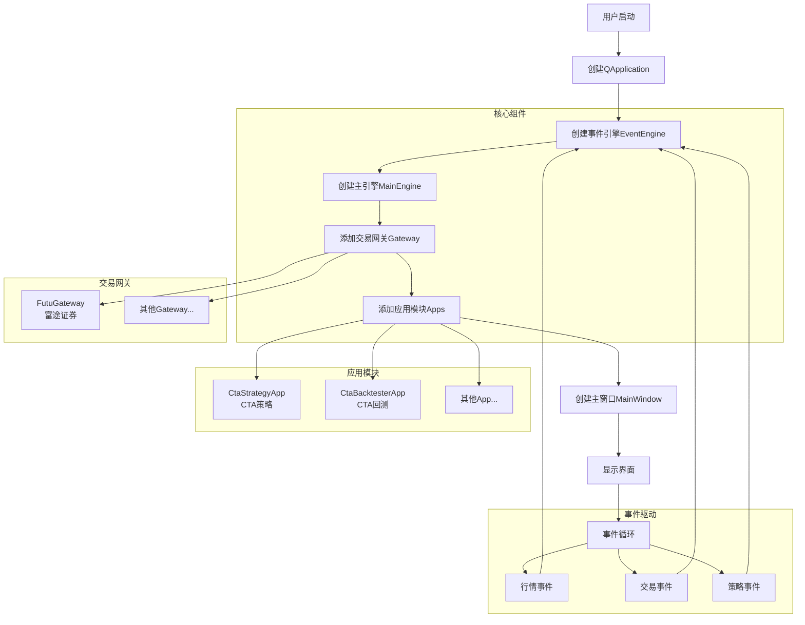
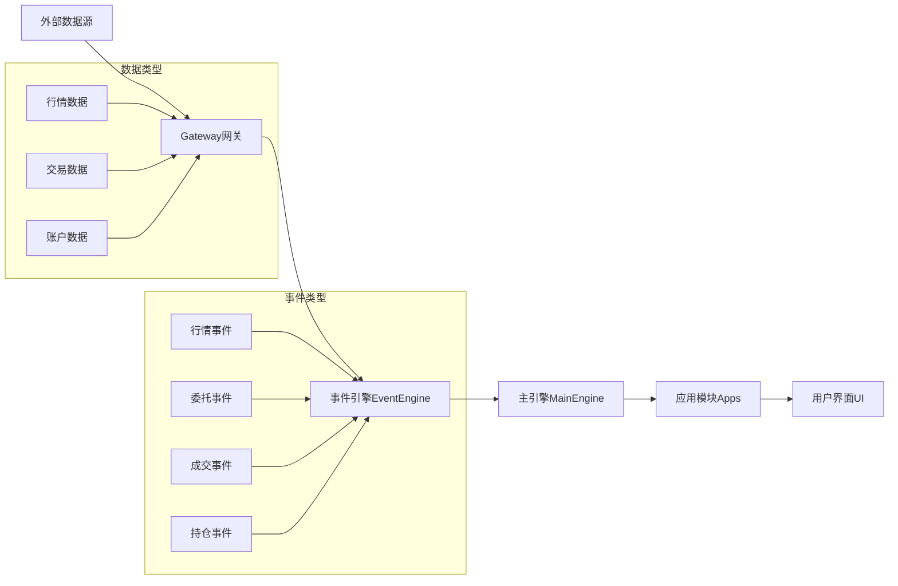
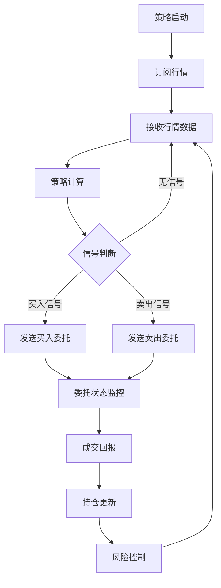
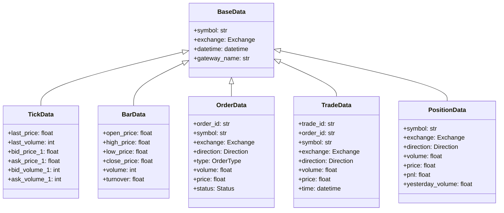

# VeighNa量化交易系统文档

## 目录
1. [系统流程图](#系统流程图)
2. [代码结构图](#代码结构图)
3. [用户使用说明](#用户使用说明)
4. [功能说明](#功能说明)
5. [使用教程](#使用教程)

---

## 系统流程图

### 整体架构流程



### 数据流程图



### 策略执行流程



---

## 代码结构图

### 项目目录结构

```
vnpy_uv_macos/
├── main.py                 # 主程序入口
├── pyproject.toml         # 项目配置文件
├── README.md              # 项目说明文档
├── vnpy/                  # VeighNa核心框架
│   ├── __init__.py
│   ├── event.py           # 事件引擎
│   ├── trader/            # 交易模块
│   │   ├── engine.py      # 主引擎
│   │   ├── gateway.py     # 网关基类
│   │   ├── object.py      # 数据对象
│   │   └── ui/            # 用户界面
│   ├── chart/             # 图表模块
│   ├── alpha/             # AI量化模块
│   └── ...
├── vnpy_futu/             # 富途证券网关
│   ├── __init__.py
│   ├── futu_gateway.py    # 富途网关实现
│   └── setup.py
├── strategies/            # 策略目录
│   ├── my_strategy.py
│   └── turtle_strategy.py
├── examples/              # 示例代码
│   ├── veighna_trader/
│   ├── client_server/
│   └── ...
├── tests/                 # 测试代码
└── docs/                  # 文档目录
```

### 核心模块功能说明

#### 1. 主程序入口 (main.py)
- **功能**: 系统启动入口，负责初始化所有核心组件
- **主要操作**:
  - 创建Qt应用实例
  - 初始化事件引擎
  - 初始化主引擎
  - 添加交易网关和应用模块
  - 创建并显示主窗口

#### 2. 事件引擎 (vnpy/event.py)
- **功能**: 事件驱动架构的核心，负责事件的发布和订阅
- **主要组件**:
  - Event: 事件基类
  - EventEngine: 事件引擎，管理事件队列和处理器
  - Event类型: 行情事件、交易事件、策略事件等

#### 3. 主引擎 (vnpy/trader/engine.py)
- **功能**: 交易系统的核心引擎，协调各个模块
- **主要功能**:
  - 网关管理
  - 应用管理
  - 订单路由
  - 数据分发
  - 风险控制

#### 4. 交易网关 (vnpy_futu/futu_gateway.py)
- **功能**: 连接外部交易接口的适配器
- **主要功能**:
  - 连接富途证券API
  - 行情数据订阅
  - 交易委托发送
  - 账户信息查询
  - 持仓信息查询

#### 5. 应用模块
- **CtaStrategyApp**: CTA策略应用，提供策略运行环境
- **CtaBacktesterApp**: CTA回测应用，提供策略回测功能

### 数据对象结构



---

## 用户使用说明

### 系统要求
- **操作系统**: Windows 10+, Linux, macOS
- **Python版本**: Python 3.10+
- **依赖环境**: 
  - PySide6 (GUI框架)
  - futu-api (富途证券API)
  - 其他依赖见pyproject.toml

### 安装步骤

#### 1. 环境准备
```bash
# 克隆项目
git clone [项目地址]
cd vnpy_uv_macos

# 创建虚拟环境
python -m venv .venv
source .venv/bin/activate  # Linux/macOS
# 或 .venv\Scripts\activate  # Windows

# 安装依赖
uv sync
```

#### 2. 配置富途证券
- 下载并安装富途证券桌面客户端
- 注册富途证券账户
- 获取API权限

#### 3. 启动系统
```bash
uv run main.py
```

### 基本配置

#### 交易网关配置
在系统启动后，需要在界面中配置富途证券网关：
- 服务器地址
- 账户信息
- 交易密码

#### 策略配置
- 将策略文件放入strategies目录
- 在策略管理界面中加载策略
- 配置策略参数

---

## 功能说明

### 核心功能

#### 1. 交易功能
- **多市场支持**: 港股、美股、A股期货
- **多种订单类型**: 限价单、市价单、条件单
- **实时行情**: Tick级实时行情数据
- **交易执行**: 快速订单执行和状态反馈

#### 2. 策略功能
- **CTA策略**: 商品交易顾问策略
- **策略回测**: 历史数据回测分析
- **参数优化**: 策略参数自动优化
- **实时监控**: 策略运行状态实时监控

#### 3. 数据功能
- **历史数据**: K线数据、Tick数据下载
- **数据管理**: 数据存储和查询
- **数据导出**: 支持多种格式导出

#### 4. 风险控制
- **仓位控制**: 最大仓位限制
- **资金管理**: 资金使用限制
- **止损止盈**: 自动止损止盈功能

### 界面功能

#### 1. 主窗口
- **菜单栏**: 系统设置、功能模块
- **工具栏**: 常用功能快捷按钮
- **状态栏**: 系统状态、连接状态

#### 2. 模块窗口
- **行情窗口**: 实时行情显示
- **交易窗口**: 委托下单界面
- **持仓窗口**: 持仓信息显示
- **策略窗口**: 策略管理界面

---

## 使用教程

### 教程1: 基础交易操作

#### 步骤1: 启动系统
```bash
uv run main.py
```

#### 步骤2: 连接交易网关
1. 在主界面找到"网关管理"或"连接管理"
2. 选择富途证券网关
3. 输入账户信息
4. 点击连接

#### 步骤3: 查看行情
1. 在行情窗口中查看实时行情
2. 可以搜索感兴趣的股票代码
3. 查看K线图表和Tick数据

#### 步骤4: 下单交易
1. 在交易窗口中选择股票
2. 输入交易数量和价格
3. 选择买卖方向
4. 点击下单按钮

### 教程2: 运行CTA策略

#### 步骤1: 准备策略文件
```python
# strategies/my_strategy.py
from vnpy_ctastrategy import CtaTemplate

class MyStrategy(CtaTemplate):
    def __init__(self, cta_engine, strategy_name, vt_symbol, setting):
        super().__init__(cta_engine, strategy_name, vt_symbol, setting)
        
    def on_init(self):
        """策略初始化"""
        self.write_log("策略初始化")
        
    def on_start(self):
        """策略启动"""
        self.write_log("策略启动")
        
    def on_stop(self):
        """策略停止"""
        self.write_log("策略停止")
        
    def on_tick(self, tick):
        """Tick数据推送"""
        pass
        
    def on_bar(self, bar):
        """K线数据推送"""
        pass
```

#### 步骤2: 加载策略
1. 在策略管理界面中点击"添加策略"
2. 选择策略文件
3. 配置策略参数
4. 点击"初始化"

#### 步骤3: 启动策略
1. 策略初始化完成后
2. 点击"启动"按钮
3. 策略开始运行
4. 监控策略状态

### 教程3: 策略回测

#### 步骤1: 准备历史数据
1. 使用数据下载功能获取历史数据
2. 确保数据质量和完整性

#### 步骤2: 配置回测参数
1. 在回测界面中选择策略
2. 设置回测时间范围
3. 配置初始资金和手续费
4. 设置回测参数

#### 步骤3: 运行回测
1. 点击"开始回测"按钮
2. 等待回测完成
3. 查看回测结果

#### 步骤4: 分析结果
1. 查看收益曲线
2. 分析各项指标
3. 导出回测报告

### 教程4: 数据管理

#### 步骤1: 下载数据
1. 在数据管理界面中选择数据类型
2. 设置时间范围和股票代码
3. 点击"下载"按钮

#### 步骤2: 查看数据
1. 在数据浏览器中查看已下载的数据
2. 可以预览K线数据
3. 检查数据完整性

#### 步骤3: 导出数据
1. 选择要导出的数据
2. 选择导出格式(CSV, Excel等)
3. 点击"导出"按钮

### 常见问题解决

#### Q1: 连接富途证券失败
**A**: 检查以下几点：
- 富途证券客户端是否正常运行
- 网络连接是否正常
- 账户密码是否正确
- API权限是否开启

#### Q2: 策略运行异常
**A**: 检查以下几点：
- 策略代码是否有语法错误
- 数据订阅是否正常
- 策略参数是否合理
- 日志信息查看具体错误

#### Q3: 行情数据延迟
**A**: 检查以下几点：
- 网络连接质量
- 数据源状态
- 系统资源使用情况

---

## 技术支持

### 官方文档
- VeighNa官网: https://www.vnpy.com
- 官方文档: https://www.vnpy.com/docs
- 社区论坛: https://www.vnpy.com/forum

### 联系方式
- GitHub Issues: [项目Issues页面]
- 官方QQ群: 262656087
- 微信群: 扫描官网二维码加入

---

*本文档最后更新时间: 2026-01-24*