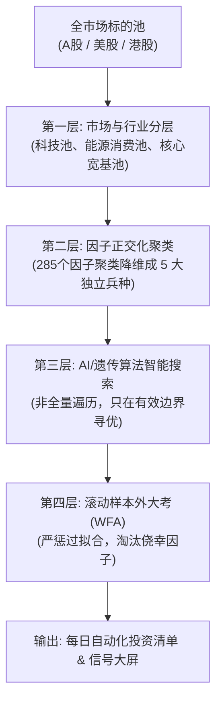
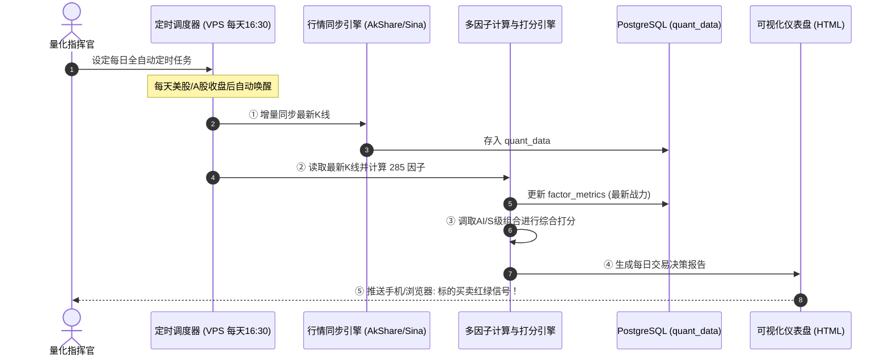

# 🏭 全自动多因子量化投研体系实施蓝图 (小白到高阶全流程白话指南)

> **目标**：彻底解决股票多、因子多、组合爆炸、无从下手的痛点，构建一套从「市场分类 ➔ 因子降维 ➔ AI/遗传算法自动搜索 ➔ 样本外回测 ➔ 每日实盘打分」的工业级全自动流水线。

---

## 一、 核心痛点与数学现实：为什么不能盲目排列组合？

### 1. 组合爆炸的灾难
- 假设有 **285 个因子**，如果不加筛选，只挑 3 个做组合：
  $$C(285, 3) = \frac{285 \times 284 \times 283}{3 \times 2 \times 1} \approx 3,822,230 \text{ 种组合}$$
- 如果再乘以 **5000 只股票**，就是 **190 亿次运算**！普通电脑跑一年也跑不完。
- **更可怕的后果：数据挖掘偏差（Data Snooping Bias）与过拟合**。从 190 亿次组合中总能撞大运撞出一个回测翻十倍的组合，但实盘必死，因为那是纯粹的巧合与噪声。

### 2. 华尔街顶级对冲基金的解决逻辑：四层降维漏斗（Funnel Pipeline）

---

## 二、 市场与行业怎么分？先分类还是后分类？

### 答案：必须先分类！

不同股票的“脾气秉性”（微观驱动力）完全相反：
- **美股科技股（NVDA, AAPL）**：动量因子、突破因子、大单资金冲击因子极强；
- **公用事业与传统能源（XOM, SO）**：均值回归、股息率、低波动率因子极强；
- **A 股高换手小盘股**：超跌反转、情绪背离、量价分歧因子极强；
- **港股大型蓝筹（00700 腾讯）**：宏观流动性与长期均线支撑因子极强。

### 推荐的实战标的池分类体系（从简入繁）：

| 标的池 (Universe) | 典型标的 | 核心有效因子倾向 | 策略风格 |
| :--- | :--- | :--- | :--- |
| **池 A：美股科技七巨头 (Magnificent 7)** | AAPL, MSFT, NVDA, GOOGL, AMZN, META, TSLA | 趋势动量、大单冲击 (`qlib_wvma`)、高点突破 | 趋势追随 + 紧密跟踪止损 |
| **池 B：港股核心资产蓝筹** | 00700.SEHK, 09988.SEHK, 03690.SEHK | 极端超跌反转 (`wq_alpha_001`)、VWAP 支撑 | 黄金坑低吸 + 估值均值回归 |
| **池 C：A 股中证全指成长池** | 新能源、半导体、高端制造龙头 | 量能异动 (`vol_turnover_accel`)、KDJ 极值 | 短波段波段战法 |

---

## 三、 算力与算法解法：怎么从 285 个因子自动筛出最有价值的组合？

### 第一阶段：单因子体检（自动淘汰 70% 的杂音）
- **操作**：使用已搭建的 `run_factor_olympics.py`；
- **规则**：
  - Rank IC < 0.02 或胜率 < 50% ➡️ **直接淘汰（打入 D 级黑名单）**；
  - 只保留 Rank IC > 0.035 且 IC_IR > 0.5 的 **前 50 个优质种子因子**。

### 第二阶段：相关性聚类（剔除双胞胎）
- 很多因子虽然名字不同，但长相几乎一样（比如 `ma_5` 和 `ma_10`，相关性高达 95%）。把高度相关的因子放在一起会造成权重失衡；
- **算法**：利用皮尔逊相关系数矩阵（Correlation Matrix），要求入选的因子之间**相关性绝对值 < 0.35**。
- **最终提炼为 5 大独立兵种**：
  1. **冲锋动量兵**：如 `wq_alpha_019`
  2. **超跌抄底兵**：如 `wq_alpha_094`
  3. **主力资金兵**：如 `qlib_wvma_5`
  4. **日内博弈兵**：如 `qlib_kmid`
  5. **防暴避险兵**：如 `chaikin_vol`

### 第三阶段：AI 深度学习 / 遗传算法自动寻优

#### 方式 A：LightGBM 决策树非线性学习（最推荐、最稳健）
- **逻辑**：将这 5 大兵种的得分作为输入 $X$，股票未来 5 天收益率作为真实标签 $Y$；
- **优势**：树模型能自动发现“如果主力资金流入 **且** 处于超跌状态，则胜率飙升至 78%”这种人类肉眼难以发现的非线性交叉规律；
- **输出**：直接由模型输出每日股票综合看多概率（0.0 ~ 1.0）。

#### 方式 B：遗传规划（Genetic Programming - 自动公式杂交）
- **逻辑**：把原子算子（加减乘除、`ts_delay`、`ts_corr`）当作基因染色体；
- **变异与交叉**：由系统在后台生成 1000 个随机公式，每代淘汰夏普比率低于 1.0 的公式，保留前 10% 进行基因杂交；
- **产物**：自动进化出全新的自定义公式，并自动写入 `quant_data.factor_meta` 数据库。

---

## 四、 全自动投研与交易工程架构（如何落地？）

---

## 五、 小白落地实施路径建议（3步走路线图）

### 第一阶段（本周完成）：建立基准并跑通首个闭环
1. 在 **美股科技池（AAPL 等）** 和 **港股核心池（腾讯等）** 上，选定 3 个各兵种的 S 级因子；
2. 运行现有的 `multi_factor_strategy` 回测，记录年化收益、夏普比率和最大回撤作为你的**第一代基准（Baseline）**；
3. 将每日信号生成挂上 VPS 定时任务，每天下班看一次自动生成的 HTML 报告。

### 第二阶段（下周推进）：AI / LightGBM 因子组合自动训练
1. 编写特征抽取脚本，把经过相关性过滤的 30 个核心因子提取成特征矩阵；
2. 训练 LightGBM 模型，对比人工简单加权与 AI 动态打分的胜率差异；
3. 验证是否有更强抗回撤能力。

### 第三阶段（进阶探索）：遗传算法夜间自动挖矿
1. 启动遗传规划引擎，设定目标为「年化 > 25% 且 最大回撤 < 12%」；
2. 每天自动把挖出的新公式注册进 `quant_data.factor_meta` 表中。
