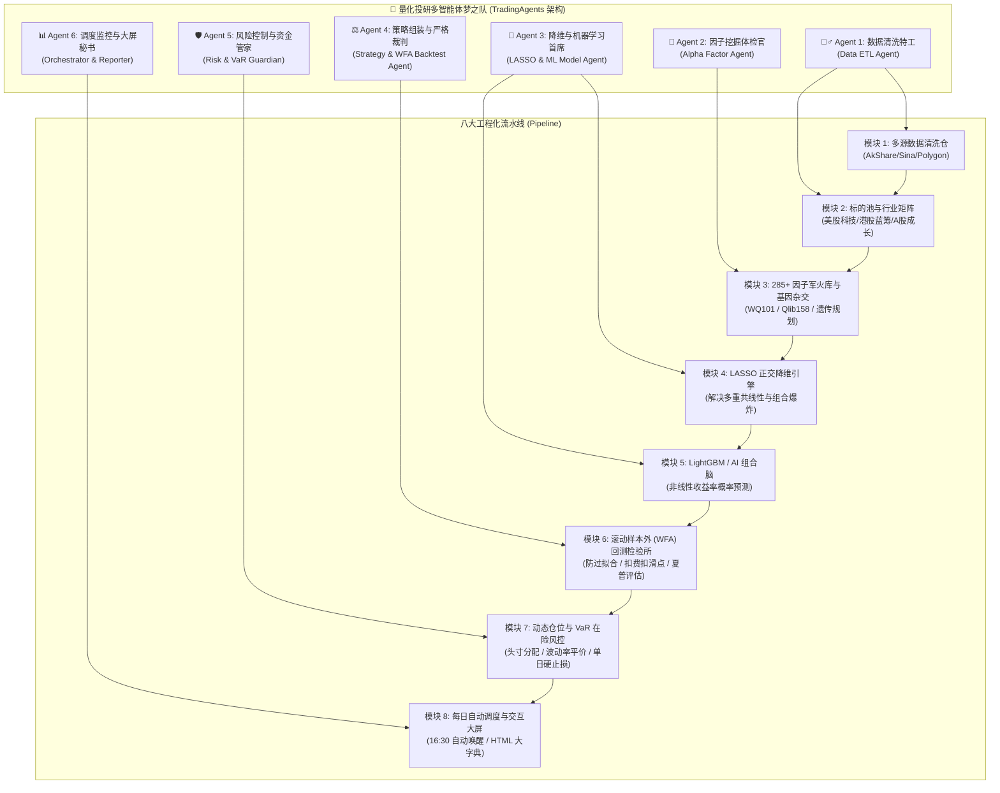

# 🏛️ 多智能体全自动量化投研交易系统全局架构蓝图

> **文献与知识库溯源**：深度融合 `docs/books` 核心思想（`TradingAgents` 多智能体协同、`factor.md` 之 LASSO 降维筛选、`quant_books.md` 之主动投资组合管理与 VaR 风控、`quant_data.md` 之多市场源、`quant_step.md` 之标准化 6 步工程闭环）。
> **系统目标**：打破黑盒，将「数据清洗 ➔ 行业分层 ➔ 因子挖掘 ➔ LASSO降维 ➔ AI模型 ➔ 回测大考 ➔ 组合风控 ➔ 每日实盘」拆解为 8 个标准化模块，并定义 6 大智能体（Multi-Agent）各司其职、全天候闭环运行。

---

## 零、 全局多智能体协同流水线大图 (Multi-Agent Architecture)



---

## 一、 八大功能模块逐步深度展开 (每个步骤完全透明)

---

### 模块 1：多源数据接入、清洗与特征对齐仓 (Data Hub & ETL)
> **输入依据**：`docs/books/quant_data.md` (AkShare, Tushare, Polygon.io) + `quant_step.md` (数据清洗 10 步法)

#### 1. 目标与定位
解决多源行情（A股、港股、美股）的接口碎片化、复权失真、脏数据与节假日时区对齐问题，为下游提供标准化的 OHLCV 纯净数据库。

#### 2. 具体执行步骤（Step-by-Step）
1. **多数据源自动故障转移（Failover Fetching）**：
   - A 股主通道：东方财富 / 新浪财经（AkShare）；备用通道：腾讯网通道；
   - 港股主通道：富途/新浪港股 API；
   - 美股主通道：Polygon.io / yfinance，海外 VPS 直连无网络墙。
2. **前复权（Forward Split & Dividend Adjustment）**：
   - 必须按除权除息日将历史股价前复权，避免分红送股导致的价格虚假跳空爆仓。
3. **数据清洗与质量评估（Data Validation Pipeline）**：
   - **停牌与缺失值处理**：前向填充（Forward-fill）最多 3 天，超过 3 天标记为长期停牌并暂停交易；
   - **极值滤波**：剔除成交量为 0 的虚假交易日；剔除 `high < low` 或 `close > high` 的异常错误行；
   - **VWAP 成交均价补齐**：如果原始数据无 VWAP，自动以累计成交金额除以累计成交量计算：$VWAP = \frac{\sum (Close \times Volume)}{\sum Volume}$。
4. **数据库持久化落盘**：
   - 统一写入 PostgreSQL 远程专用库 `quant_data.quant_data`，建立 `(symbol, exchange, interval, datetime)` 复合唯一索引，使用 Upsert 幂等写入，跑任意多次不产生一条重复数据。

---

### 模块 2：标的池动态分层与行业切片矩阵 (Universe Slicer)
> **输入依据**：`docs/books/quant_knowledge_keywords.md` (估值赛道选择、精准医疗式细颗粒度)

#### 1. 目标与定位
避免“一把抓”导致科技股与公用事业股互相抵消。在跑策略前，先将股票按**流动性、波动率与行业属性**切分成独立战场。

#### 2. 具体执行步骤（Step-by-Step）
1. **流动性初筛（Liquidity Filter）**：
   - 剔除日均成交金额（ADV20）低于 2000 万港币/5000 万人民币/1000 万美元的流动性枯竭股票（仙股、闪崩股直接踢出）。
2. **三大多元标的池（Universe Pools）分层**：
   - **池 A（美股科技七巨头池 - Growth & Momentum Pool）**：
     - 标的：`AAPL`, `MSFT`, `NVDA`, `GOOGL`, `AMZN`, `META`, `TSLA`；
     - 核心特性：机构主导、趋势惯性大、抗跌性强；优先匹配动量与突破因子。
   - **池 B（港股核心蓝筹池 - Blue-chip Value & Reversion Pool）**：
     - 标的：`00700.SEHK (腾讯)`, `09988.SEHK (阿里)`, `03690.SEHK (美团)`；
     - 核心特性：受宏观外资与南向资金双重影响，波动边界明显；优先匹配超跌反转与 VWAP 支撑因子。
   - **池 C（A 股高成长赛道池 - Alpha Retail Sentiment Pool）**：
     - 标的：新能源、半导体、机器人行业龙头；
     - 核心特性：散户换手率高、情绪脉冲强；优先匹配量比膨胀与博弈反转因子。
3. **输出物**：每个标的池生成一个动态文本名单（如 `watchlist_us_tech.txt`, `watchlist_hk_core.txt`），供回测与实盘直接调用。

---

### 模块 3：285+ 世界级因子军火库与遗传规划杂交引擎 (Factor Store & Genetic Miner)
> **输入依据**：`docs/books/factor.md` (因子库、jqfactor_analyzer) + `quant_books.md` (101 Formulaic Alphas)

#### 1. 目标与定位
不仅拥有现存的 285 个华尔街与微软高频因子，还能像生物进化一样，由计算机自动杂交变异产生全新超额收益因子。

#### 2. 具体执行步骤（Step-by-Step）
1. **全量维护已有的 285 个原子因子**：
   - **WorldQuant 101 公式（101 个）**：全套保留原版公式（包括 `adv20`, `SignedPower`, `quesval` 三元运算等），在 `gemini_quant/factors/wq_alpha101_full.py` 纯向量化执行；
   - **微软 Qlib 158 工业特征（158 个）**：涵盖 K 线形态、5/10/20/30/60 日时序斜率、R方确定度、波幅加权大单离散；
   - **经典技术先锋（26 个）**：KDJ-J 线、CCI 顺势指标、威廉 WR、佳庆离散波动率等。
2. **符号回归与遗传规划自动挖矿（Genetic Programming Miner）**：
   - **基因元算子池**：定义原子算子集合 `[+, -, *, /, log, abs, sign, ts_delay, ts_delta, ts_corr, ts_std, ts_rank]`；
   - **种群初始化**：生成 1000 棵随机语法树（每个树代表一个由加减乘除组合的因子公式）；
   - **适应度评估（Fitness Evaluation）**：在近 3 年历史数据上计算每个新公式的 Rank IC 与夏普比率；
   - **交叉与变异（Crossover & Mutation）**：保留前 10% 表现最优的公式作为“父母本”，随机交换子树（交叉）或随机替换算子（变异），繁衍下一代；
   - **自动注册与入库**：进化出夏普比率 > 1.5 且相关性低的新公式，自动写入 `quant_data.factor_meta` 数据库，永久固化！

---

### 模块 4：LASSO 正交降维与特征筛选引擎 (LASSO & Dimensionality Reduction)
> **输入依据**：`docs/books/factor.md` 核心论述：“LASSO 和 Elastic Net 是改善多元线性回归模型的多重共线性，实现降维的进阶版。整几千个因子跑个 lasso 筛选” + `quant_books.md` (PCA 主成分分析)

#### 1. 目标与定位
彻底解决排列组合爆炸与多重共线性（Multicollinearity）。把 285 个因子中高度相似的“双胞胎因子”剔除，只保留 5~8 个信息纯度最高的正交兵种。

#### 2. 具体执行步骤（Step-by-Step）
1. **单因子体检初筛（Screening Threshold）**：
   - 对 285 个因子计算在各标的池上的 $IC$（信息系数）、$Rank\_IC$、$IC\_IR$ 和 5 日多头胜率；
   - 规则：$|Rank\_IC| < 0.02$ 或 胜率 $< 50\%$ 的因子，直接判定为纯噪声，**一键剔除（淘汰率约 60%）**。
2. **LASSO 稀疏正则化惩罚筛选（LASSO Sparsity Feature Selection）**：
   - 构建回归模型：以股票未来 5 天收益率 $Y_{t+5}$ 为被解释变量，以剩下的因子 $X_1, X_2, \dots, X_p$ 为特征；
   - 引入 L1 范数正则化惩罚项：
     $$\min_{\beta} \frac{1}{2n} \|Y - X\beta\|_2^2 + \lambda \|\beta\|_1$$
   - **LASSO 的神效**：L1 正则化会自动把那些走势雷同、信息重叠的冗余因子系数直接压缩为精确的 **0**！只有真正具备独立增量预测力的因子，其系数才不为 0。
3. **皮尔逊相关性聚类验证（Orthogonality Check）**：
   - 最终挑选出的因子必须满足：两两之间的相关系数绝对值 $|Corr(X_i, X_j)| < 0.35$；
   - 提炼为 **5 大独立战力梯队**：
     - ① **动量前锋**（趋势推动）：`wq_alpha_019`
     - ② **超跌后卫**（均值回归）：`wq_alpha_094`
     - ③ **大单资金**（机构冲击）：`qlib_wvma_5`
     - ④ **K线博弈**（日内控盘）：`qlib_kmid`
     - ⑤ **波动防暴**（变盘预警）：`chaikin_vol`

---

### 模块 5：LightGBM / AI 组合打分与模型训练脑 (AI Meta-Alpha Brain)
> **输入依据**：`docs/books/factor.md` (机器学习模型: Random Forest, Neural Networks) + `quant_step.md` (建立数学模型)

#### 1. 目标与定位
摆脱人工拍脑袋给因子定权重的落后做法，利用机器学习自动学习 5 大兵种在不同行情下的**非线性交叉规律**，输出未来上涨概率。

#### 2. 具体执行步骤（Step-by-Step）
1. **样本矩阵构建（Dataset Builder）**：
   - **特征矩阵 $X$**：过去历史每日由 5 大正交因子算出的标准化得分（Z-Score 标准化，去极值 Winsorize）；
   - **标签向量 $Y$**：未来 5 天的对数收益率：$Y_t = \ln(Close_{t+5} / Close_t)$。二分类模式下，$Y_t > 0$ 记为 1（上涨），$Y_t \le 0$ 记为 0（震荡或下跌）。
2. **训练集、验证集与测试集严格划分（Time-Series Split）**：
   - 严禁打乱时序（严禁随机 Shuffle，防止未来函数穿越！）；
   - 前 70% 时间为训练集（Train），中间 15% 为超参数验证集（Validation），后 15% 为严格盲测测试集（Test）。
3. **LightGBM / Random Forest 决策树集成训练**：
   - 采用早停机制（Early Stopping, 50 轮无提升则停止），最大深度设为 4~6 层（防止过拟合）；
   - 模型会自动挖掘出交叉规律，例如：
     - *“规则 1：当【大单资金流入分 > 75】且【超跌指标进入极值区】时，未来 5 天大涨概率为 81.3%”*；
     - *“规则 2：当【动量冲高】但【主力资金呈净流出】时，属于高位诱多，模型打分骤降至 20 分（回避）”*。
4. **输出物**：每天收盘后输入今日最新数据，模型输出一个 **`0.0 ~ 1.0` 的综合看多置信度（Alpha Probability Score）**。

---

### 模块 6：严格回测验证与防过拟合大考所 (Backtesting & WFA Lab)
> **输入依据**：`docs/books/quant_step.md` (回测和优化、参数优化、过滤器、持续测试) + `quant_knowledge_keywords.md` (多年经验浓缩验证)

#### 1. 目标与定位
用华尔街机构级别最严苛的标准检验策略，扣除一切手续费、滑点，杜绝任何“回测猛如虎，实盘亏成狗”的虚假神话。

#### 2. 具体执行步骤（Step-by-Step）
1. **真实交易摩擦成本全扣除（Friction Modeling）**：
   - A 股：佣金万三 + 印花税千一 + 滑点 1 个最小价格跳动（PriceTick）；
   - 港股：印花税千一 + 佣金千一 + 平台费 + 滑点 0.05 港币；
   - 美股：佣金每股 0.005 美元 + 滑点 0.01 美元。
2. **滚动前瞻样本外验证（Walk-Forward Analysis, WFA）**：
   - 采用 1 年滚动训练、后续 3 个月做样本外盲测，依次推进；
   - 如果策略在训练期年化 50%，但样本外暴跌，判定为**过拟合死模型**，直接作废。
3. **多基准严苛对比（Benchmark Comparison）**：
   - 每一份回测报告必须同时画出三条曲线：
     - 🔵 **策略净值曲线 (Strategy Equity)**
     - ⚪ **买入并持有基准曲线 (Buy & Hold Benchmark)**
     - 🔴 **现金与回撤曲线 (Drawdown Curve)**
4. **硬核指标体检卡**：
   - 年化收益率（Annual Return > 20%）
   - 夏普比率（Sharpe Ratio > 1.5）
   - 卡玛比率（Calmar Ratio = 年化 / 最大回撤 > 1.8）
   - 最大回撤（Max Drawdown < 15%）
   - 盈亏比（Profit/Loss Ratio > 2.0）

---

### 模块 7：执行与实盘风控守卫站 (Execution & Risk Guardian)
> **输入依据**：`docs/books/quant_books.md` (VaR 在险价值: 历史模拟/协方差矩阵/蒙特卡洛) + `quant_knowledge_keywords.md` (风险收益高性价比、头寸管理)

#### 1. 目标与定位
保住本金是量化的第一法则。控制单次下注比例，遇到极端黑天鹅能够自动止损拔插头。

#### 2. 具体执行步骤（Step-by-Step）
1. **动态在险价值测算（VaR: Value at Risk）**：
   - 每日收盘前，用**历史模拟法与协方差矩阵法**测算当前持仓在 99% 置信度下的最大可能单日亏损；
   - 如果系统整体 VaR 超过总资金的 3%，触发仓位警报，强制削减杠杆。
2. **波动率倒数动态仓位分配（Inverse Volatility Position Sizing）**：
   - 低波动平稳期：适当加大头寸至 80%~90%；
   - 高波动剧震期：自动将单只股票仓位压缩至 20%~30%，实现“波动大时仓位轻，波动小时仓位稳”。
3. **双重硬风控止损网**：
   - **单标的追踪止损（Trailing Stop）**：自买入后最高点回撤达 6% 触发止盈/止损平仓；
   - **单日巨亏硬熔断（Black-Swan Breaker）**：如果当日总资产亏损超过 2.5%，当天系统全部停止开仓，强制锁定交易接口，防止情绪化反复交易。

---

### 模块 8：全自动化调度与决策汇报中心 (Scheduler & Executive Dashboard)
> **输入依据**：`docs/books/quant_video.txt` (自动化、全栈工程、HTML/CSS/JS 可视化概念) + `quant_step.md`

#### 1. 目标与定位
无需人工盯盘，每天收盘后海外 VPS 自动触发全套流水线，5 分钟内完成数据同步、打分与图表渲染，将红绿买卖信号直接呈现在大屏与移动端。

#### 2. 具体执行步骤（Step-by-Step）
1. **Linux Crontab / 定时器全自动调度**：
   - 16:30（港股收盘后）：自动唤醒，同步腾讯等港股核心资产行情；
   - 04:30（美股收盘后）：自动唤醒，同步苹果、英伟达等美股行情；
2. **自动化流水线无缝串联**：
   - ① 增量同步 ➔ ② 计算 285 因子最新数值 ➔ ③ 调取 AI 模型合成多空得分 ➔ ④ 判断买入/卖出规则 ➔ ⑤ 更新数据库 `quant_data.factor_metrics`；
3. **生成轻量级交互网页仪表盘**：
   - 输出全新的 `daily_signal_dashboard.html`，展示：
     - 标的红绿灯推荐表（🟢 强力买入 / 🟡 观望持有 / 🔴 坚决清仓）；
     - 当前主力因子雷达图；
     - 资金曲线与账户风控实时水位图；
   - 支持手机浏览器或电脑一键点开直观查看。

---

## 二、 多智能体团队分工矩阵 (TradingAgents Team Mapping)

按照你引用的 `TauricResearch/TradingAgents` 多智能体协同理念，我们将 8 大流水线分配给 **6 个具有独立提示词与工具集的专业智能体**：

| 智能体角色 (Agent Role) | 专属职责 | 依赖工具 / 代码模块 | 输入 ➔ 输出 |
| :--- | :--- | :--- | :--- |
| **🕵️‍♂️ Agent 1: 数据清洗特工 (Data ETL Agent)** | 负责多源爬取、前复权检查、异常值清洗与数据库落盘 | `scripts/save_watchlist.py`, `quant_data/sync_full_production.py` | 交易所原生接口 ➔ PostgreSQL `quant_data` 纯净表 |
| **🔬 Agent 2: 因子挖掘体检官 (Alpha Factor Agent)** | 负责 285 个世界级公式计算、单因子 IC 体检、遗传算法杂交新因子 | `gemini_quant/factors/`, `run_factor_olympics.py` | 纯净 K 线 ➔ `quant_data.factor_meta` 知识库 & IC 排行榜 |
| **🧠 Agent 3: 降维与机器学习首席 (LASSO & ML Agent)** | 负责 LASSO 正交降维、去共线性、LightGBM 训练与多因子置信度打分 | `gemini_quant/portfolio/combiner.py`, LightGBM / Scikit-Learn | 285 因子全集 ➔ 5 大正交兵种 & 每日预测看多得分 (0~100) |
| **⚖️ Agent 4: 策略组装与严格裁判 (Backtest & WFA Agent)** | 负责买卖规则制定、扣费扣滑点回测、滑动样本外（WFA）防过拟合大考 | `run_backtest.py`, `strategies/multi_factor_strategy.py` | 策略参数 ➔ 资金曲线、夏普比率、最大回撤报告 |
| **🛡️ Agent 5: 风险控制与资金管家 (Risk & VaR Guardian)** | 负责头寸规模测算、波动率平价仓位管理、VaR 在险价值与硬止损保护 | 动态仓位算法模块、VaR 风险模型 | 账户资产与持仓 ➔ 下单手数限制 & 熔断止损指令 |
| **📊 Agent 6: 调度监控与大屏秘书 (Orchestrator & Reporter)** | 负责 VPS 每日定时调度、整合全流程、生成交互式 HTML 仪表盘与信号推送 | `daily.py`, `build_factor_encyclopedia.py`, HTML/Plotly | 各 Agent 产物 ➔ 终极直观可视化决策看板 |

---

## 三、 小白落地四阶段实战攻坚路线图

```mermaid
gantt
    title 多智能体量化系统四阶段落地工程排期
    dateFormat  YYYY-MM-DD
    section 第一阶段: 基准闭环跑通
    标的池分类 (美股科技/港股核心)       :done, 2026-09-25, 1d
    285因子库与数据库持久化               :done, 2026-09-25, 1d
    跑通单资产多因子策略基准回测          :active, 2026-09-26, 2d
    section 第二阶段: 降维与AI大脑
    LASSO 稀疏化筛选与相关性聚类         :2026-09-28, 3d
    LightGBM 决策树多因子交叉模型训练    :2026-10-01, 3d
    section 第三阶段: 自动化与风控
    VaR 在险价值测算与动态仓位网关       :2026-10-04, 2d
    VPS 16:30 自动流水线定时任务调度     :2026-10-06, 2d
    section 第四阶段: 遗传进化与实盘
    遗传规划夜间自动挖矿新因子           :2026-10-08, 4d
    生成每日决策大屏与实盘模拟监控       :2026-10-12, 3d
```

---

## 四、 核心设计准则（永不触碰的红线）

1. **绝对不搞蛮力全量遍历**：285 因子必须经过「单因子体检 ➔ LASSO 正交降维」两次漏斗过滤，才允许进入模型；
2. **严防未来函数（Look-ahead Bias）**：所有特征计算只用 $t$ 日及之前的已收盘数据，严禁在 $t$ 日使用 $t$ 日收盘后才产生的数据；
3. **真实交易摩擦必须置顶**：任何不扣印花税、手续费和滑点的策略回测一律视为“玩具模型”，不予上线；
4. **透明化可视化贯穿始终**：每一个模块的输出都有结构化数据表落库（PostgreSQL）和交互式 HTML 页面可视化，绝不留下任何黑盒！
