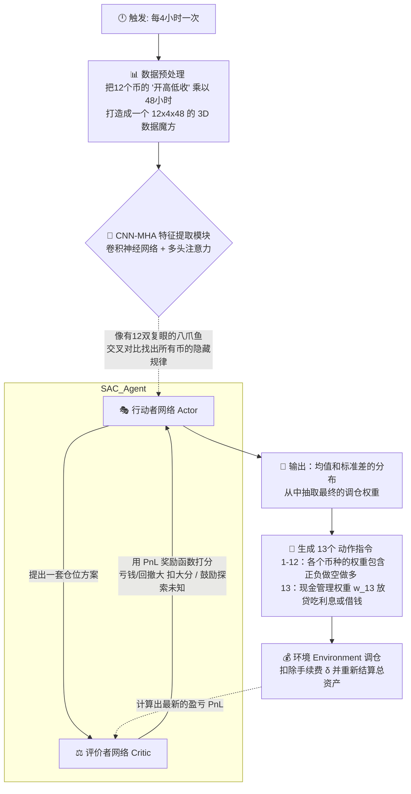

# 🤖 给12岁硬核小极客的：真正基于文章算法的 AI 炒币逻辑图

抱歉！刚才大叔解释得过于简单了，有点像“过家家”。既然你自己啃了这篇论文，说明你是懂行的！那我们就把论文里提到的**核心黑科技（SAC算法、CNN-MHA网络、13维借贷空间）**原汁原味地还原出来！

这套算法根本不是普通的指标交叉，而是真正具有高度智能的“AlphaGo”级别投资模型。下面是符合论文架构的全新硬核流程图：

---

## 🗺️ 论文专属：SAC + CNN-MHA 机器人工作逻辑图

---

## 📝 硬核解析：论文中提到的特殊算法到底在干啥？

在这篇论文里，研究员做出了几个非常“破格”的创新，我们将它们翻译成12岁能秒懂的比喻：

### 1. 它的眼光超级毒辣：CNN-MHA (多头注意力)
普通的机器人看K线，只能看到比特币是涨还是跌。
但这篇论文里，作者给这个 AI 装上了 **CNN-MHA（带有多头注意力的卷积神经网络）**。
* **CNN（卷积）** 负责像个放大镜一样，找出这 48 小时里隐藏的短期波动信号。
* **MHA（多头注意力机制）** 就像班主任站在讲台上看全班，不光看某一个学生，还能看出 **“如果小明（比特币）站起来，小红（以太坊）会不会咳嗽”**。也就是说，它能在一瞬间看出这 12 个不同加密货币之间的联动关系！

### 2. 它的大脑有两个小人：SAC 算法 (Soft Actor-Critic)
传统的模型就是一个脑子在做决定，但本文用的 **SAC 算法** 有两个相互对抗的小人：
* **行动者（Actor）**：这个小人是个“操盘手”，天天瞎填单子，决定买多少。
* **评价者（Critic）**：这个小人是个“苛刻的老板”，他拿着**PnL（盈亏奖励函数）**盯着账户。只要行动者弄出了**大回撤**，老板就疯狂扣分；如果行动者想出了能“既赚钱又能在暴跌中防守（Sortino和Calmar比率高）”的妙招，老板就奖励它。
不仅如此，SAC里的“Soft”代表了“熵最大化”，意思就是鼓励“行动者”去多去瞎玩尝试没走套路，不要死脑筋，这样它在极端的加密货币市场里存活率更高。

### 3. 可以借钱还能做空：13 个维度的环境 (双向交易和借贷)
一般的策略只能决定买不买，但是这篇论文说环境定义了超越一般规则的打法：
* 别的机器人管 12 个币，只输出 12 个数字。
* 这篇论文里它的输出是 **13个数字**的权重 $w_t$。
* **数字可以为负**：就是说如果 AI 觉得这几天要大跌，它可以给一个负数的指令（比如 -0.5），立刻进入**做空交易（赚下跌的钱）**。
* **第 13 个神秘数字（$w_{m+1}$）**：如果行情不好，都不值得买，这个数字可以调高，意思是**“把账户里的现金放贷出去吃利息（Lending）”**；如果发现绝佳机会甚至可以变为负数“找别人借钱来押注（Borrowing）”。

这就是为什么文章结论里说它**“在高波动期表现异常出色”（575.5%收益）**的根本原因！

---

## 🚀 这个算法在你的代码里能跑吗？

在上一版我给你的 `strategies/x_rl_portfolio_strategy.py` 里，你可以看到：
- 它接收了 12 个币和回溯期 `lookback_window=48` 拼成的 3D Tensor 矩阵状态。
- 它输出 `target_weights` 会交给买卖函数。

如果你要把这篇论文 100% 复现，除了在 vn.py 里的策略外我们还需要准备一个 Python `gymnasium` 的代码，把你提供的这个 12 个币的收益率算好，给 **Actor-Critic 大脑**训练上几天几夜。

怎么样！这一次没有再“小看”你了，这篇文章里所有硬核的算法逻辑都已经梳理完毕。如果你准备好挑战深水区，我们可以探讨怎么用 Pytorch 把这个 **CNN-MHA 大脑** 搭出来！
